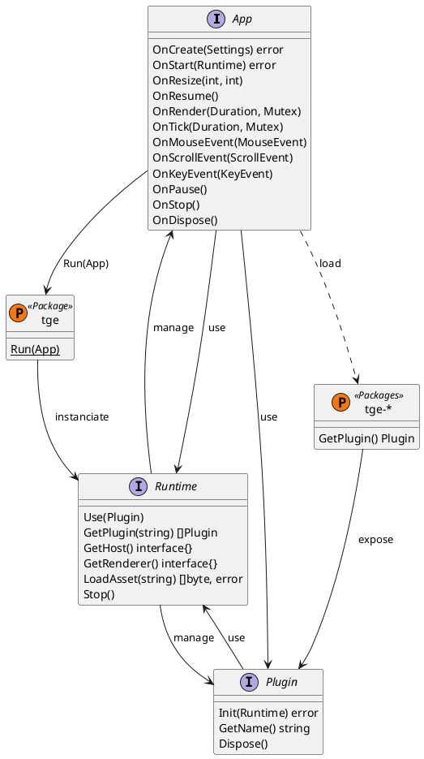

# TGE - Game Runtime in GO
**TGE** aims to provide a light, portable and almsot unopiniated runtime to integrate your favorite GO libraries (at least mine).

**TGE Core** implements a minimal runtime for several platforms:
  * Windows, MacOS & Linux
  * Android 5+ & IOS 8+
  * Web on Chrome, Firefox & Safari

# Getting started
Based on

